<div align="center">

# 🧠 CodeMind

**An AI codebase assistant that lets you chat with any GitHub repository — powered by a production-grade hybrid RAG pipeline, not a single vector-search call.**

[](https://www.python.org/)
[](https://streamlit.io/)
[](https://www.llamaindex.ai/)
[](LICENSE)

</div>

---

## What is this?

Point CodeMind at any public GitHub repository, and it clones, indexes, and lets you have a real conversation about the codebase — "where is auth handled?", "explain the retry logic in the API client", "what would break if I changed this function?" — with cited file sources for every answer.

Most codebase-chat demos wrap a single vector search around an LLM call. CodeMind doesn't — it's built as a **multi-stage retrieval pipeline** (hybrid search → fusion → reranking) because code search has different failure modes than prose search: exact identifier matches matter as much as semantic meaning, and a single embedding pass misses both.

---

## Architecture

```mermaid
flowchart TD
    subgraph Indexing["📥 Indexing Pipeline (runs once per repo)"]
        A[GitHub URL] -->|git clone| B[Repository Files]
        B --> C{File type?}
        C -->|Code: .py .js .ts etc| D[AST-Aware Chunking<br/>tree-sitter, function/class boundaries]
        C -->|Text: .md .json etc| E[Token-Based Chunking]
        D --> F[Embedding Model<br/>Gemini]
        E --> F
        F --> G[(Vector Index<br/>dense/semantic)]
        F --> H[(BM25 Index<br/>sparse/keyword)]
        I[File Hash Manifest] -.tracks changes for.-> B
    end

    subgraph Retrieval["💬 Query Pipeline (runs per message)"]
        Q[User Question] --> QR[Query Rewriting<br/>LLM generates query variants]
        QR --> VS[Vector Search]
        QR --> BS[BM25 Search]
        VS --> RF[Reciprocal Rank Fusion]
        BS --> RF
        RF --> RR[Cross-Encoder Reranking<br/>local model, top-5]
        RR --> CTX[Context + Chat History]
        CTX --> LLM[LLM Answer Generation<br/>Gemini]
        LLM --> ANS[Answer + Cited Sources]
    end

    G --> VS
    H --> BS

    style Indexing fill:#1a1625,stroke:#b088f9
    style Retrieval fill:#1a1625,stroke:#f770a1
```



---

## Key Features

| Feature | What it does | Why it matters |
|---|---|---|
| **AST-aware chunking** | Splits code along function/class boundaries using `tree-sitter`, instead of blind fixed-size token windows | A chunk that cuts a function in half is useless context — this never happens here |
| **Hybrid retrieval** | Combines dense vector search (meaning) with BM25 sparse search (exact keywords), merged via Reciprocal Rank Fusion | Code search needs both: "what handles retries" is semantic, `retry_with_backoff` is a literal identifier — pure vector search misses the second |
| **Cross-encoder reranking** | A local, free cross-encoder re-scores the fused candidates before they reach the LLM | Raw similarity scores are noisy; reranking is the single highest-leverage step for retrieval precision |
| **Incremental indexing** | SHA-256 file-hash manifest tracks what changed; only new/modified files are re-embedded, stale nodes are deleted first | Re-indexing a repo doesn't duplicate nodes or re-burn API quota on unchanged files |
| **Condense+Context chat** | Multi-turn conversations are condensed into a standalone query before retrieval | Follow-ups like "what about the error handling in there?" resolve correctly instead of being embedded in isolation |
| **Source citations** | Every answer links back to the exact file and relevance score it was drawn from | No black-box answers — you can verify every claim |

---

## Why these design choices

A few decisions worth calling out, since they're the actual engineering content of this project:

- **Hybrid over pure-vector search** — Pure semantic search is the default in most RAG tutorials, but it consistently misses exact-match queries (function names, error codes, config keys) that are common in code search. BM25 fusion closes that gap.
- **Reranking over raw top-k** — Vector similarity and BM25 scores aren't on the same scale and are individually noisy. A cross-encoder that scores the query against each candidate jointly is a cheap, high-impact correction — and it runs locally, so it adds no API cost.
- **Chunk at the AST level, not the token level** — Token-based splitters are language-agnostic but structure-blind. Splitting at function/class boundaries preserves the unit of meaning a developer actually reasons about.
- **Manifest-based incremental indexing** — The naive approach (`insert_nodes` on every run) silently duplicates content on re-index. Tracking file hashes and deleting stale nodes first was a deliberate fix, not an afterthought.

---

## Tech Stack

| Layer | Technology |
|---|---|
| UI | Streamlit |
| RAG Framework | LlamaIndex |
| LLM & Embeddings | Google Gemini (`gemini-2.5-flash`, `text-embedding-004`) |
| Sparse Retrieval | BM25 (`rank-bm25`) |
| Reranking | Sentence-Transformers cross-encoder (local, free) |
| Code Parsing | tree-sitter |
| Repo Access | GitPython |

---

## Project Structure

```
codemind/
├── app.py                  # Streamlit UI — clone, index, and chat
├── requirements.txt
├── .env.example
└── backend/
    ├── config.py            # Central config: models, chunk sizes, retrieval params
    ├── chunking.py           # AST-aware code chunking (tree-sitter)
    ├── indexer.py             # Clone, chunk, embed, incremental index build
    └── retriever.py            # Hybrid retrieval, reranking, chat engine
```

---

## Getting Started

### 1. Clone and install
```bash
git clone https://github.com/Abhijeetmishra1924/codemind-rag.git
cd codemind-rag
pip install -r requirements.txt
```

### 2. Configure your API key
```bash
cp .env.example .env
```
Add your [Gemini API key](https://aistudio.google.com) to `.env`:
```
GEMINI_API_KEY=your_key_here
```
> CodeMind runs entirely on a free Gemini API key — no other paid service is required. The reranker and BM25 search run locally at no extra cost.

### 3. Run
```bash
streamlit run app.py
```

### 4. Use it
Paste a public GitHub repo URL in the sidebar, click **Clone & Index Repository**, then ask it anything about the codebase.

---

## Configuration

All tunable via `.env` — see [`.env.example`](.env.example) for the full list. Notable ones:

| Variable | Default | Purpose |
|---|---|---|
| `RERANKER_PROVIDER` | `local` | `local` (free, self-hosted) or `cohere` (hosted, needs `COHERE_API_KEY`) |
| `FUSION_NUM_QUERIES` | `3` | How many query variants to generate for retrieval |
| `RERANK_TOP_N` | `5` | Final chunk count sent to the LLM after reranking |
| `ENABLE_HYDE` | `true` | Hypothetical-document embedding for the single-shot query engine |

---

## Roadmap

- [ ] Retrieval evaluation harness (RAGAS — context precision/recall, faithfulness)
- [ ] Interactive codebase mindmap (component hierarchy with short descriptions)
- [ ] Multi-hop / sub-question retrieval for cross-file questions
- [ ] Persistent hosted vector store (swap local disk index for Qdrant/pgvector)

---

## License

MIT
